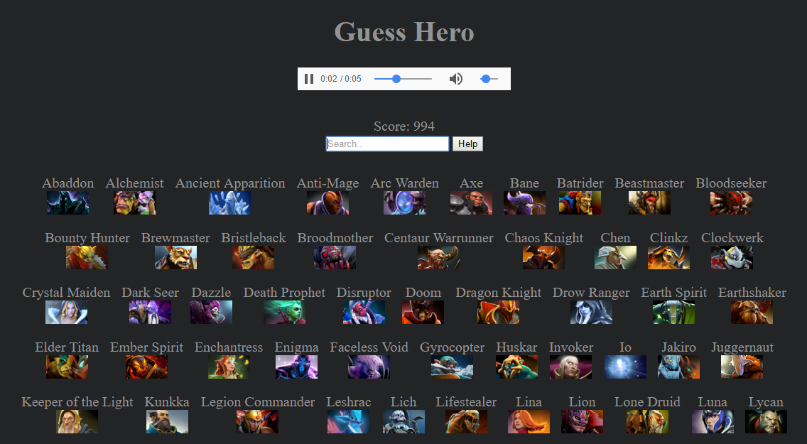

# [Try it out here!](http://nbpt.eu/games/dota_guess_hero/) #

Try to guess the dota hero, based on the sounds being played.

Click on the hero to make a guess. You can also search for its name on the search entry, to filter the hero list. Press the `enter` key to guess the first element currently on the list.

# Keyboard Shortcuts #

- `down/right arrow` - Select the next valid hero in the list.
- `up/left arrow` - Select the previous valid hero in the list.
- `enter` - Try to guess the currently selected hero.

# Usage #

- `tsc --watch` -- Compiles on file changes.
- `python -m http.server` -- Run local server (open `localhost:8000` on a browser to run the game).
- Can also just open the `index.html` in a browser.

# Dependencies #

- [typescript](https://www.typescriptlang.org/) `2.1`
- [utilities](https://bitbucket.org/drk4/javascript_utilities) `1.9`

# Attribution #

- Sounds are linked from [dota2 gamepedia](http://dota2.gamepedia.com/).
- Sounds/images are part of the game [dota2](http://www.dota2.com/).
- Icon from [here](https://www.reddit.com/r/DotA2/comments/4oqatp/minimalistic_hero_icons/).
